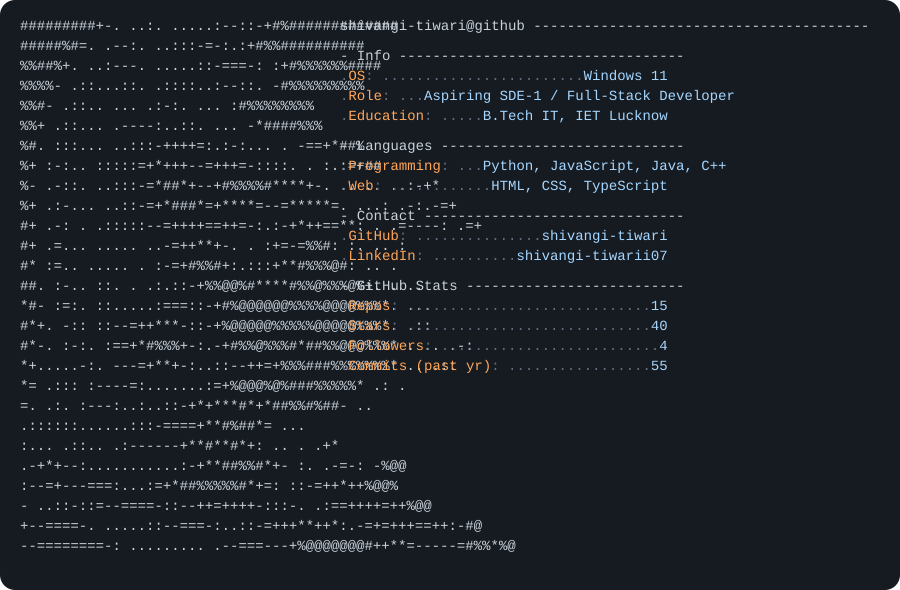

# Hi, I'm YOUR NAME 👋

<picture>
  <source media="(prefers-color-scheme: dark)" srcset="dark_mode.svg">
  <source media="(prefers-color-scheme: light)" srcset="light_mode.svg">
  
</picture>

<!--
This card is auto-generated once a day by the GitHub Action in
.github/workflows/main.yml, which runs generate_readme.py and commits
dark_mode.svg / light_mode.svg back into this repo. GitHub's <picture>
tag then shows whichever one matches the viewer's system theme.
-->

## About Me

Write a short bit about yourself here — what you do, what you're learning,
what you're building.

## What I'm Working On

- Project 1
- Project 2

## Connect

- LinkedIn:
- GitHub:
